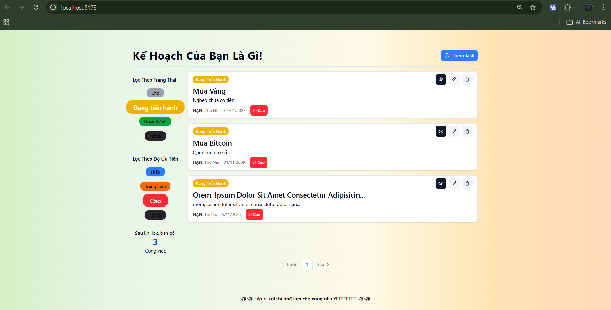

# 🚀 MERN Todo App – CRUD

## 📌 Giới thiệu

Đây là dự án MERN đầu tiên của tôi — một ứng dụng Todo List đơn giản nhưng đầy đủ tính năng CRUD và lọc dữ liệu.

Dự án được xây dựng nhằm thực hành:

- Cách xây dựng API cơ bản với Express + MongoDB
- Cách kết nối frontend–backend
- Validate form bằng React Hook Form + Zod
- Quản lý state bằng Context API + useState
- Tách component và tổ chức code rõ ràng

---

## 🖼️ Demo / Screenshot

### **Demo**

https://my-todo-fe.vercel.app

### **Screenshot**



---

## 🛠️ Tech Stack

### Frontend

- React + JavaScript
- React Hook Form (RHF) + Zod
- React Context API (dùng để quản lý todo state)
- Axios
- Vite

### Backend

- Node.js + Express.js
- MongoDB + Mongoose
- CORS
- REST API CRUD

---

## ✨ Tính năng

### **Công việc CRUD**

- Thêm Công việc
- Sửa Công việc
- Xóa Công việc
- Đánh dấu hoàn thành

### **Lọc dữ liệu**

- Filter theo trạng thái
- Filter theo độ ưu tiên

### **Phân trang (Pagination)**

- Backend hỗ trợ page, limit
- Trả về totalPages, currentPage
- Frontend hiển thị nút chuyển trang, số trang

### **Validate form bằng RHF + Zod**

- Kiểm tra các trường bắt buộc

---

## 🚀 Cài đặt & Chạy dự án

### **1. Clone project**

```bash
git https://github.com/taikhoanchuafile/my-todo.git
cd my-todo
```

### **2.Backend setup**

```bash
cd backend
npm install
```

- Vào my-todo/backend tạo file **.env**

````bash
PORT=5001
# port của api backend (http://localhost:PORT)

MONGODB_CONNECTIONSTRING=<url csdl của mongodb>
# Key URL mongodb. Vd:mongodb+srv:....@cluster0.jerdkbp.mongodb.net/devGG?appName=Cluster0

FRONTEND_URL=http://localhost:5173
#port frontend React

- Chạy backend(/my-todo/backend)

```base
npm run dev
````

### **3.Setup frontend**

```bash
cd ../frontend
npm install
```

- Vào my-todo/frontend tạo file **.env**

```base
VITE_API_URL=http://localhost:5000
# Nếu PORT Backend thay đổi: http://localhost:<PORT>/api
```

- Chạy Frontend(/my-todo/frontend)

```base
npm run dev
```

- Ctrl + Chuột trái vào URL: _http://localhost:5173_ để mở dự án trên trình duyệt

## 📄 License

Dự án phát hành theo giấy phép [MIT](./LICENSE).
