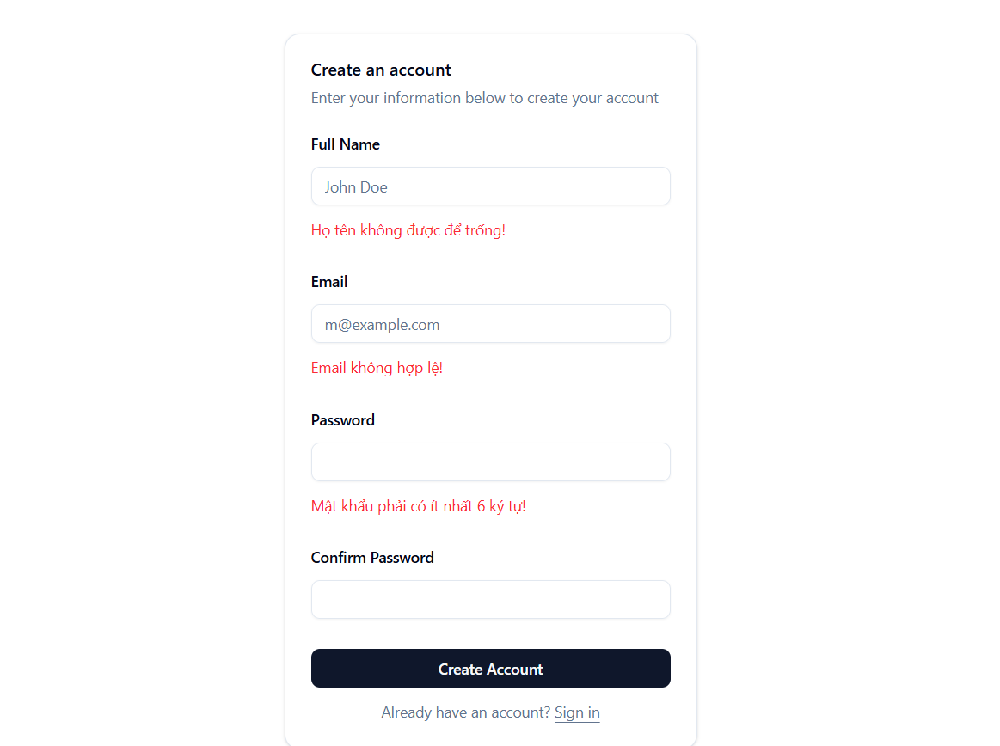
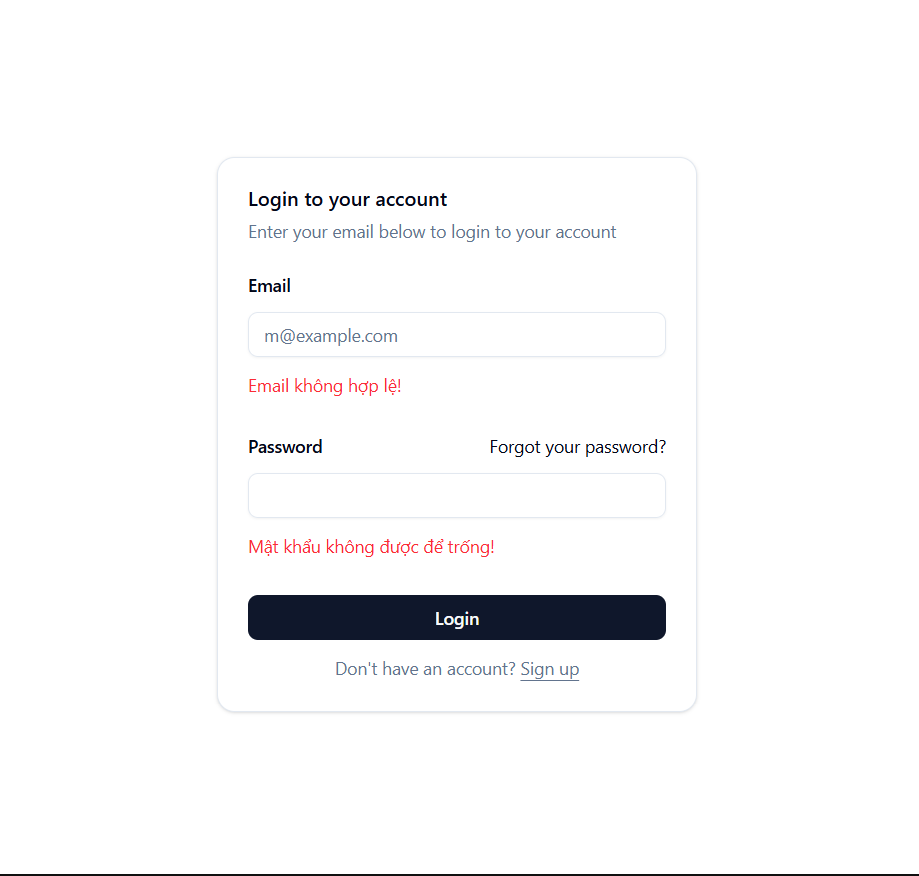
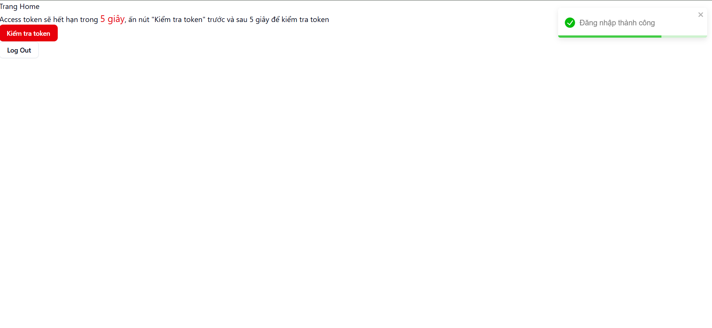
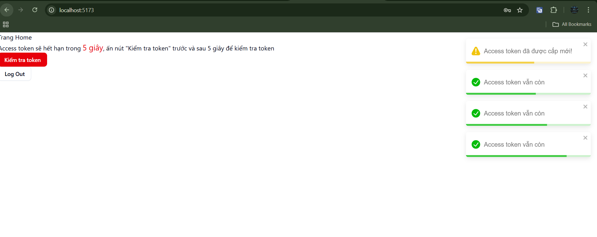

# 🚀 Auth System

## 📌 Giới thiệu

Dự án này là ứng dụng MERN Stack cho phép người dùng thực hiện thủ công **authentication**,  
Mục tiêu: Tìm hiểu về **authentication**- cấu trúc rõ ràng, tách service, middleware, controller đầy đủ.

Dự án tập trung vào:

- Đăng ký / đăng nhập bằng email & password
- Xác thực bằng Access Token + Refresh Token
- Lưu refresh token an toàn bằng HttpOnly Cookie
- Tách rõ frontend & backend theo mô hình thực tế
- Toàn bộ logic xác thực được xây dựng thuần JWT

---

## 🖼️ Demo / Screenshot

### **Demo**

https://auth-fe-sigma.vercel.app

### **Screenshot**






---

## 🛠️ Tech Stack

### Frontend

- React + TypeScript
- Vite
- Zustand (quản lý state)
- RHF + Zod (form xác thực)
- Axios + interceptor (refresh token)
- React Router DOM

### Backend

- Node.js + Express.js
- MongoDB + Mongoose
- JSON Web Token (JWT)
- Bcrypt / Crypto (hash token)
- Cookie HttpOnly / refresh token

---

## 🧰 Công nghệ và khái niệm chính

### **JWT - JSON WEB TOKEN**

- Dùng để tạo token xác thực cho người dùng sau khi đăng nhập thành công. Gồm 2 loại:
- **Access Token:** token ngắn hạn(15-30 phút), dùng để xác thực các request đế server.
- **Refresh Token:** token dài hạn(7-30 ngày), dùng để cấp lại access token khi hết hạn.

### **Cooki HttpOnly**

- Lưu refresh token an toàn trên trình duyệt, **JS không thể truy cập**, tránh rủi ro XSS.

### **Node.js + Express.js**

- Backend tiếp nhận, xử lý, gửi phản hồi, cung cấp API xác thực.

### **MongoDB + Mongoose**

- Lưu thông tin user và refresh token.

---

## 🔄 Quy trình Login Google

**1. Đăng ký (Register)**

- User nhập thông tin đăng ký: email/password/confirm password

- FE xác thực validate, nếu hợp lệ, FE gửi dữ liệu lên BE
- BE xác thực, hash password bằng bcrypt và lưu vào MONGODB, phản hổi FE
- FE chuyển đến trang Đăng nhập(Login)

**2. Đăng nhập (Login)**

- User nhập email + password
- BE xác thực, kiểm tra user tồn tại, so sánh password.

Nếu hợp lệ, BE sẽ:

- Tạo **access token** (ngắn hạn) gửi response về FE.
- Tạo **refresh token** (dài hạn) lưu trong MONGODB và gửi qua cookie về FE.

**3. FE sử dụng access token để gọi API**

- Nếu access token hết hạn thì FE gửi request lên BE(refresh-token) để nhận về access token mới mà không cần phải đăng nhập lại.

**4. Đăng xuất**

- BE sẽ xóa **refress token** trong MONGODB và cookies.
- Access token hết hạn tự động đăng xuất.

---

## 🚀 Cài đặt & Chạy dự án

### **1. Clone project**

```bash
git clone https://github.com/taikhoanchuafile/auth.git
cd auth
```

### **2.Backend setup**

```bash
cd backend
npm install
```

- Vào auth/backend tạo file **.env**

```bash
PORT=5001
# port của api backend (http://localhost:PORT)

MONGLEDB_API_URL=<url csdl của mongodb>
# Key URL mongodb. Vd:mongodb+srv:....@cluster0.jerdkbp.mongodb.net/devGG?appName=Cluster0

FRONTEND_URL=http://localhost:5173
#port frontend React

ACCESS_TOKEN_SECRET=<key access tokeb>
# VD:c39acd4a56d3a428767a9a5bd7f37a6b9ea40d1278401aeef (chuỗi bất kỳ)
```

- Chạy backend(/auth/backend)

```base
npm run dev
```

### **3.Setup frontend**

```bash
cd ../frontend
npm install
```

- Vào auth/frontend tạo file **.env**

```base
VITE_API_BASE_URL=http://localhost:5001/api
# Nếu PORT Backend thay đổi: http://localhost:<PORT>/api
```

- Chạy Frontend(/auth/frontend)

```base
npm run dev
```

- Ctrl + Chuột trái vào URL: _http://localhost:5173_ để mở dự án trên trình duyệt

## 📄 License

Dự án phát hành theo giấy phép [MIT](./LICENSE).
